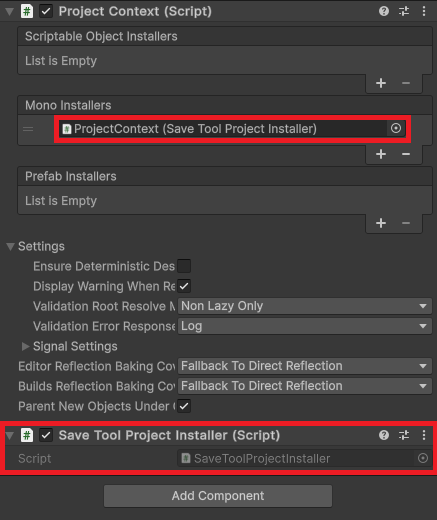

# UnitySaveTool
Библиотека для удобного сохранения информации в вашем приложении на Unity
## Основные преимущества:
* **Простота использования**
    - Если в проекте используется DI фреймворк, то сохраняемые типы данных будут зарегистрированы как зависимости и DI контейнер автоматически внедрит их.
    - Библиотека уже поддерживает такую работу с Zenject, для работы с другими DI фреймворками смотри здесь.
* **Возможность выбирать контекст сохранения**
    - **[Глобальный контекст]** Для сохранения данных в области видимости всего проекта (Настройки, кеш и т.д.)
    - **[Контекст игрового прогресса]** Для данных игрового прогресса которые не привязаны к конкретной сцене (Инвентарь игрока, количество смертей и т.д.)
    - **[Контекст сцены]** Для сохранения данных о конкретной сцене. Данные сцены защищены от доступа или изменения из другой сцены (Случайно сгенерированная карта, позиции передвинутых игроком предметов и т.д.)
* **Модульность и расширяемость**
    - Можно заменить или расширить функционал отдельных частей, зарегистрировав собственные реализации интерфейсов библиотеки в DI контейнере
* **Выбор между синхронной и асинхронной работой системы сохранения**
## Проблема, которую решает библиотека
Представим, что есть класс TestSaveData, который нужно сохранить:
```C#
[Serializable]
public class TestSaveData
{
    // Базовые типы данных
    public int playerLevel = 0;
    public float playerHealth = 0f;
    public string playerName = "";
    public bool isPremium = false;

    // Дата и время
    public DateTime lastSaveTime = default;
    public TimeSpan playTime = default;

    // Коллекции
    public List<string> unlockedAchievements = new List<string>();
    public Dictionary<string, int> inventory = new Dictionary<string, int>();

    // Массивы
    public Vector3[] checkpoints = Array.Empty<Vector3>();

    // Вложенные классы
    public PlayerStats stats = new PlayerStats();
    public List<QuestProgress> activeQuests = new List<QuestProgress>();

    // Специфичные для Unity типы
    public Color playerColor = default;
    public Vector3 playerPosition = default;
    public Quaternion playerRotation = default;

    // Перечисления
    public Difficulty difficulty = default;
    public CharacterClass characterClass = default;

    // Словарь магазина
    public SerializableDictionary<string, ShopItem> shopItems = new SerializableDictionary<string, ShopItem>();

    // Перечисления
    public enum Difficulty { Easy, Normal, Hard }
    public enum CharacterClass { Warrior, Mage, Rogue, Archer }
}
```
А также класс Player, который изменяет состояния в TestSaveData:
```C#
public class Player : MonoBehaviour
{
    private TestSaveData testSaveData;

    public void ChangeData()
    {
        //Изменяю TestSaveData
    }
}
```
Нет приин пересохранения TestSaveData в середине жизненного цикла класса Player. Поэтому достаточно просто гарантировать, что вначале жизненного цикла класса Player класс TestSaveData загрузился из памяти, а в конце был сохранен обратно. Вот обычная реализация этой идеи на практике (JSON + File IO):
```C#
public class Player : MonoBehaviour
{
    private TestSaveData testSaveData;
    private string savePath;

    public void ChangeData()
    {
        //Изменяю TestSaveData
    }

    private void Awake()
    {
        savePath = Path.Combine(Application.persistentDataPath, "saveData.json");
        LoadData();
    }

    private void OnDestroy()
    {
        SaveData();
    }

    private void LoadData()
    {
        if (File.Exists(savePath))
        {
            string jsonData = File.ReadAllText(savePath);
            testSaveData = JsonUtility.FromJson<TestSaveData>(jsonData);
        }
        else
        {
            testSaveData = new TestSaveData();
        }
    }

    private void SaveData()
    {
        string jsonData = JsonUtility.ToJson(testSaveData, true);
        File.WriteAllText(savePath, jsonData);
    }
}
```

Такая реализация будет работать, но есть ряд больших недостатков:
* Нарушается один из принципов SOLID (Single Responsibility Principle). Подразумевается, что класс Player обрабатывает и изменяет информацию во время игры (Для примера это метод ChangeData). Но кроме этого Player также занимется логикой сохранения этой информации на довольно низком уровне (Вплоть до записи в файл)
* Большое количество объектов в игре, также требующих сохранения, создадут хаос в месте, где они расположены. Сохранение объектов подобным образом, без единой системы сохранения, может привести к ошибкам из-за одинакового названия файлов или еще чего-то
* Нет возможности создать еще одну ячейку игрового прогресса. Чтобы все сцены были одинаковыми, а разными на них только данные созданные игроком (ресурсы игрока, изменения в на катре от действий игрока и т.д.)

Такие рассуждения могут привести к идее рефакторинга с вынесением системы сохранения в отдельный сервис. Вот пример рефакторинга с использованием Zenject:
```C#
public class Player : MonoBehaviour
{
    private TestSaveData testSaveData;
    private string savePath;

    private ISaveService _saveService;

    [Inject]
    public void Construct(ISaveService saveService)
    {
        _saveService = saveService;

        savePath = Path.Combine(Application.persistentDataPath, "saveData.json");
        testSaveData = _saveService.Load<TestSaveData>(savePath);
    }

    public void ChangeData()
    {
        //Изменяю TestSaveData
    }

    private void OnDestroy()
    {
        _saveService.Save(testSaveData, savePath);
    }
}
```
Несмотря на некоторые оставшиесля минусы, такое решение уже имеет место быть. С большим количеством данных все еще есть вероятность ошибок, ведь путь к файлам и их названия указываются разработчиком вручную. Также можно забыть загрузить или сохранить данные в начале и в конце жизненного цикла класса, работающего с этими данными. Несмотря на приемлемость такого способа, хочется иметь еще более простой и в то же время гибкий способ сохранять данные в игре. Именно такой способ и предоставляет библиотека UnitySaveTool.

## Решение
Следующий пример будет показан с использованием DI фреймворка Zenject. Рекомендуется использовать библиотеку в сочетании с каким-либо DI контейнером. Как подключить DI контейнер, помимо Zenject, смотри здесь

1. Скачайте и установите в свой проект UnitySaveTool.unitypackage. Все будет установлено в [Assets => Plugins => UnitySaveTool]
2. Добавьте на префаб ProjectContext компонент SaveToolProjectInstaller:
   


3. Также следует добавить SaveToolSceneInstaller на все контексты сцен, где вы хотите использовать сохранения.

4. Чтобы указать, что тип данных не зарегистрирован в DI контейнере заранее и что библиотека должна зарегистрировать его там сама, а также чтобы показать в каком контексте сохранять этот тип данных, нужно классу данных добавить атрибут SaveToolData:
```C#
[Serializable]
[SaveToolData(SaveContext.Scene)] 
public class TestSaveData
{
    ...
}
// SaveContext.Scene показывает, что класс будет сохраняться в контексте сцен, на которых используется
```


